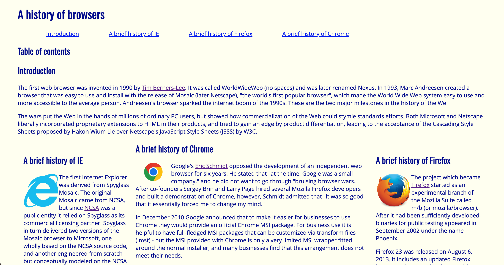
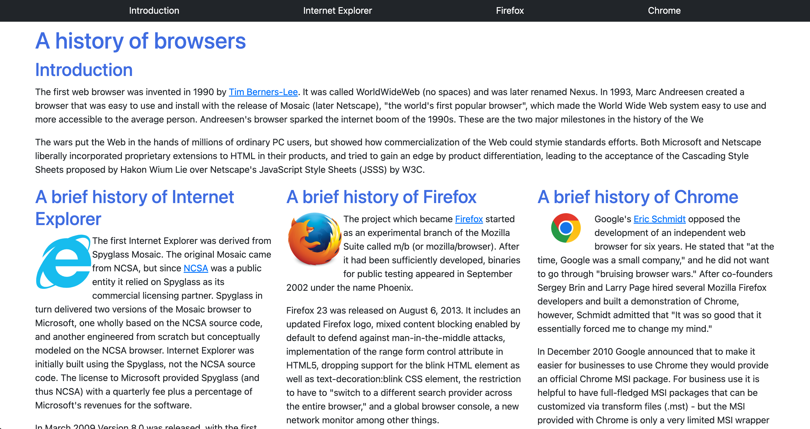

     
## Why Bother using Frameworks?
     
When I first started using basic HTML/CSS I felt like it was a walk in the park. At first I thought making a website was simple, everything seemed straightforward and manageable but it wasn’t the case when using frameworks, it felt like a whole new language. In this case we used a framework called Bootstrap 5. Bootstrap 5 is a free framework tool that helps you build websites/apps quickly with less code! I do admit it does sound like a great deal but it does take a while to have a deep understanding when using it. 

## My Experience:

I found that making a website from scratch with Bootstrap 5 was fun but frustrating in its own ways. For an assignment in my ICS 314 class, we were tasked to rebuild a website using Bootstrap 5 from scratch. Honestly, bootstrap wasn’t simple to implement. I found it more confusing than just using raw HTML and CSS. I had a hard time understanding how to use this framework and found myself almost hitting the DNF time for the practice WOD. I had to rely on many open source tools and the documentation even though at times I felt it quite overwhelming.
Sticking with plain old raw HTML/CSS can be more confusing when your code starts stacking up. I do admit that it’s good to just use it for a basic, bare-bones website but if you want to make something fancy, it gets more complicated. This is where the benefits of using a framework comes in.

## Perks of using Frameworks

I believe that Bootstrap 5 is very helpful as it gives the bare frameworks such as making a navbar. The bar is already implemented with a bit of code! It’s also great with implementing different things like drop links, footers, navigation bars that are useful for software development. This helps cut down the time significantly and **LESS CODE**. Although I don't think it’s very beginner friendly, but once you read the documentation and get familiar with it, it does become easier with time.

Finishing a website using a framework feels amazing. It's really satisfying to see something you made from scratch actually work. The tough parts make it even better, because getting through them feels fulfilling and a real win. If it was all easy, it wouldn't be as rewarding or motivating.

## A Closer Look

Can you tell which website was built with raw HTML/CSS and which one was built using Bootstrap 5?  

  
  

By no surprise the left one is the raw HTML/CSS webpage. Just by the aesthetics you can tell with the website that Bootstrap 5 looks cleaner and professional in a way. For the raw HTML/CSS page, creating simple columns required more code rather than using a framework. When I was using Bootstrap 5 to build this website, I found it very surprising that it required less coding thanks to its pre-built components. Overall, UI Frameworks is quite an amazing tool to utilize but it does come with its own learning curve. I hope to learn and utilize more frameworks to broaden my knowledge in the future. 

