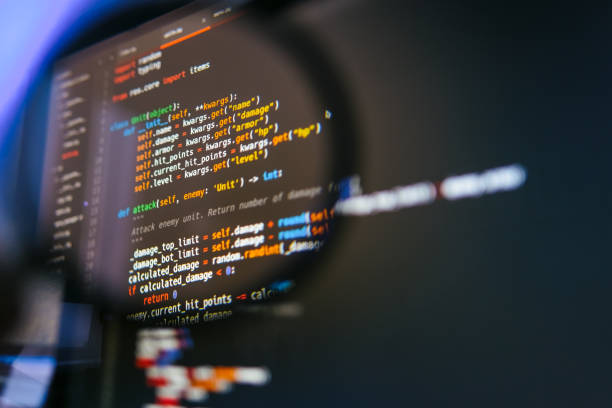
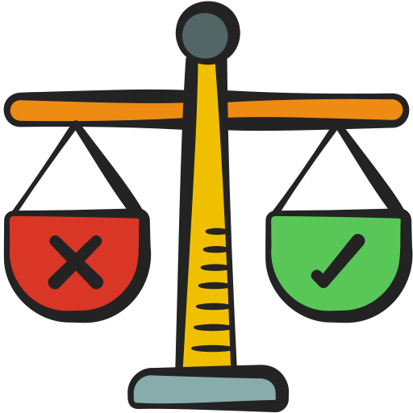

It’s already over??  This class has taught me so much in a short amount of time. When I took this class I didn’t expect much besides making websites but boy I was wrong. This class had another side to Software Engineering. This course taught me much more than web development. It introduced me to fundamental concepts like ethics and coding standards that are important in different fields, not just in software.These lessons have given me a new perspective on how widely applicable these software engineering concepts are.

## Ethics in CS?

On the last day of class, we had a debate that highlighted the importance of ethics in a workplace setting, especially with using technologies like AI. We discussed a scenario where a talented software engineer, who has eight years of experience and a well-rounded skill set at a company, applied for a promotion. However, the promotion was awarded to a newer employee who specializes in AI and tools like ChatGPT for software development. During this debate, it made me realize how crucial ethical decision-making is in companies, especially as technology evolves. Ensuring fairness and respect for all employees, regardless of their familiarity with new technologies like AI, is important for maintaining trust within a team. Situations like this show how ethics help guide the integration of new technology in the workplace in a way that respects and values everyone's contributions.

## Agile Project Management

Another concept that stood out to me was APM known as Agile Project Management. It involves breaking down large projects into smaller, more manageable tasks, making teamwork more efficient and effective. In my ICS 314 class, we used a particular style called Issue Driven Project Management (IDPM), just like divide and conquer. We used Github’s project board and issue feature. We divided things into milestones and throughout the project we had three. For each milestone we created specific goals about what we wanted to accomplish at the end of each milestone, such as, “add remove button to ListProfileAdmin.jsx page”. From that we assign it to a member. In the project board there are features that help you estimate the amount of time it will take you to complete a task (coding and non-coding) which I found very useful. There are also columns called “To-Do”, “In-Progress”, and “Done” for each milestone. I found it a very neat and helpful way to keep tasks organized. This helped us break down our project into smaller yet simple tasks and is very doable for each member in our team.

## Goodbye for now...

I wish there are more classes like this that UH has to offer. I really enjoyed the flipped classroom style as it is more hands on. As this software engineering class has come to an end, I wish to use my experience in my future education.
