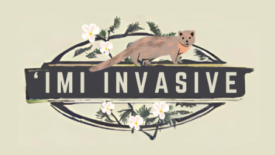

  

## Project Overview

The project ‘Imi Invasive is a web application that aims to help track and manage invasive species across the Hawaiian Islands. The application is designed to provide a platform for users to report sightings of invasive species, which can then be used to monitor and manage these species effectively. The application also provides information on invasive species, their impact on the ecosystem, and ways to prevent their spread.

‘Imi Invasive aims to address invasive species management challenges by establishing a citizen science initiative to bring the community together and educate people on invasive species, raising awareness and empowering the community and professionals to be able to better track the harmful species and care for the ecosystem. It should serve as an educational resource and also a centralized app for people to report and help manage invasive species across the Hawaiian Islands.

## Personal Contributions
 
For this project, I mainly worked on the profile pages (edit profile, list profile, and view profile) and modifying the sign up page. The profile pages are found in the top right corner dropdown. I also worked on providing test data and refining our database. Click on the images to view the source code!

### Sign-up Page
When you sign up, you are asked to fill out a form with your name, email, password, bio, and interests (bio and interests are optional). The form is validated to ensure that all fields are filled out correctly. Once the form is submitted, the user is added to the database and redirected to the home page. 

  

### Edit Profile Page
The edit profile page is found in the top right corner dropdown, this page allows users to update their profile information. Users can change their name, email, password, bio, interests, and can add a profile picture! The form is pre-filled with the user's current information, and users can update any fields as they wish. 

 

### List Profile Page
The list profile page is also found in the top right corner dropdown. This displays a list of all users in the database. Each user is displayed with their name, email, bio, and interests. Users can click on a user's name to view their profile page.

### List Profile Page Admin
The admin is allowed to delete a profile if they deem it inappropriate.

### View Profile Page
The view profile page displays a user's profile information. Users can see the user's name, email, bio, interests, and profile picture.

## What I Learned

Overall, I learned how important it is to effectively communicate/work with a team, efficiently how to research coding libraries on my own, and gained overall software engineering skills that will support me in all my future endeavors.

Thank you to my amazing group members:

- Natalie Ching
- Lily Enanoria
- Allison Ebsen
- Gian Panoy

[Click here to learn more about the project](https://islandinvaders.github.io/) 
[Check out our project on Github](https://github.com/islandinvaders/imi-invasive) 

